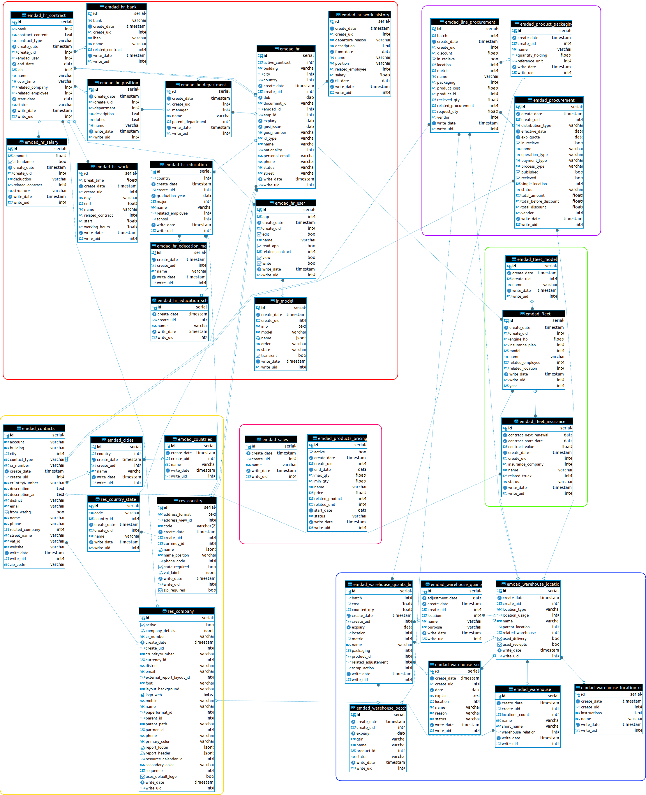

# Emdad-ERP-System
## Introduction

Emdad ERP System is an enterprise resource planning (ERP) software designed to streamline and integrate business processes across various departments within an organization. This documentation provides an overview of the system's architecture, modules, and technologies used in its development.
Architecture

Emdad ERP System is built on the Model-View-Controller (MVC) architecture pattern, which separates the application into three interconnected components: Model (data), View (user interface), and Controller (business logic).
Technologies Used

## Modules

Emdad ERP System consists of the following modules:

Products Management System: Manages the lifecycle of products, including creation, modification, and deletion.
Contacts: Manages contact information for customers, suppliers, and other relevant entities.
Finance System: Handles financial transactions, accounting, and reporting within the organization.
Finance for Products: Manages financial aspects related to products, such as pricing, invoicing, and payments.
Fleet System: Tracks and manages the organization's fleet of vehicles, including maintenance schedules and usage.
Human Resources: Manages employee-related information, including payroll, attendance, and performance evaluations.
Inventory: Tracks and manages inventory levels, stock movements, and replenishment processes.
Procurement: Handles the procurement process, including supplier management, purchase orders, and procurement analytics.
Sales System: Manages the sales process, including lead management, quotations, sales orders, and invoicing.

## Features

Customization: The system allows for customization of modules and workflows to suit the specific needs of the organization.
Integration: Emdad ERP System integrates seamlessly with other software systems and external services through APIs.
Reporting: Provides comprehensive reporting capabilities with customizable reports and analytics dashboards.
Security: Implements robust security measures to protect sensitive data and ensure compliance with regulations.
Scalability: Designed to scale with the organization's growth and accommodate increasing data and user loads.

## System architecture
Emdad ERP System follows the Model-View-Controller (MVC) architecture, which is a software design pattern that divides the application into three interconnected components:

Model: Represents the application's data and business logic. It manages the data, logic, and rules of the application domain, and responds to requests for information about its state. In the context of the Emdad ERP System, the model represents the various entities and their relationships within the system, such as products, contacts, financial transactions, etc.

View: Represents the user interface (UI) of the application. It displays data from the model to the users and interprets their interactions (e.g., clicks, inputs) to relay back to the controller. Views in the Emdad ERP System include web pages, forms, reports, and other elements that users interact with to perform tasks and access information.

Controller: Acts as an intermediary between the model and the view. It receives user input from the view, processes it by invoking the appropriate methods in the model, and updates the view with the results. In the Emdad ERP System, controllers handle user requests, validate input, perform business logic operations, and update the model accordingly.

## Models
In the Emdad ERP System, the model plays a crucial role in managing the application's data and implementing the business logic. Here's how it works:

Data Management: The model defines the structure and behavior of the data entities used in the system, such as products, contacts, financial transactions, etc. It includes attributes (fields) and methods (functions) to manipulate and interact with the data.

Business Logic: The model encapsulates the business logic of the application, including rules, calculations, and workflows related to the management of data entities. It enforces data integrity, validation rules, and business rules to ensure consistency and accuracy in the system's operations.

Database Interaction: The model interacts with the database (PostgreSQL) to perform CRUD (Create, Read, Update, Delete) operations on the data entities. It handles database queries, updates, and transactions to persist data changes and maintain data consistency.

Integration with Controllers and Views: The model communicates with controllers to process user requests and update the data accordingly. It provides methods and interfaces for controllers to access and manipulate data entities. Additionally, the model may notify views of data changes, enabling them to update their display accordingly.

By following the MVC architecture, the Emdad ERP System achieves separation of concerns, modularity, and maintainability, allowing for easier development, testing, and maintenance of the application.

Incorporate this explanation into your documentation to provide a comprehensive understanding of how the model works in the Emdad ERP System and its role within the MVC architecture. Adjust the details as needed to align with the specific implementation and requirements of your project.

## Entity Relationship Diagram

# Maintenance and Support

Updates and Maintenance: Procedures for applying updates, patches, and maintenance tasks to ensure the system's stability and security.
Support: Information about available support channels, such as documentation, community forums, and technical support services.